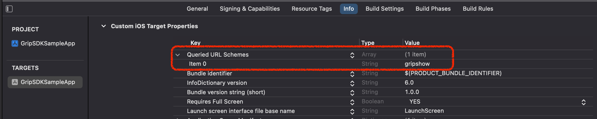

- [요구사항](#요구사항)
- [SDK 설치](#sdk-설치)
  - [CocoaPods 사용](#cocoapods-사용)
    - [참고: 외부 라이브러리 의존성](#참고-외부-라이브러리-의존성)
- [프로젝트 설정](#프로젝트-설정)
  - [앱 실행 허용 목록](#앱-실행-허용-목록)
- [초기화](#초기화)
  - [1. GripSDK 초기화](#1-gripsdk-초기화)
  - [2. 다크 모드 대응](#2-다크-모드-대응)
  - [3. 동영상 자동 재생 설정](#3-동영상-자동-재생-설정)
- [홈 컴포넌트 연동](#홈-컴포넌트-연동)
  - [홈 컴포넌트 노출 여부 판단](#홈-컴포넌트-노출-여부-판단)
  - [홈 컴포넌트 UI 연동](#홈-컴포넌트-ui-연동)
- [커머스탭 연동](#커머스탭-연동)


## 요구사항
- iOS Deployment Target 14.0 이상
- Xcode 15.0 이상 
- Swift 5.0 이상

## SDK 설치
### CocoaPods 사용

1. `Podfile`에 다음 줄을 추가하세요.
    ```ruby
    pod 'GripFramework'
    ```

2. 터미널에서 다음 명령어를 실행하세요.
    ```sh
    pod install
    ```

#### 참고: 외부 라이브러리 의존성
Grip SDK는 다음과 같은 외부라이브러리를 사용합니다. 
- iOS SDK: Moya, Alamofire, SnapKit, SDWebImage, Reachability
- ReactiveX iOS SDK: RxSwift, RxCocoa, RxAppState, RxMoya

## 프로젝트 설정
### 앱 실행 허용 목록
SDK로 **그립앱**을 실행 하려면 Info.plist 파일에 앱 실행 허용 목록을 설정해야 합니다.
1. Info > `Queried URL Schemes` 추가
2. 해당 키의 `Item` 값에 `gripshow` 추가




위 설정은 Info.plist 파일을 직접 수정해 적용할 수도 있습니다. 
```xml
<key>LSApplicationQueriesSchemes</key>
<array>
	<string>gripshow</string>
</array>
```

## 초기화

### 1. GripSDK 초기화
AppDelegate 또는 SceneDelegate에서 GripSDK를 초기화합니다.
**아래 appKey, appName 발급은 그립 담당자에 문의주세요**
- appKey: 그립에서 발급한 appKey
- appName: 그립에서 발급한 서비스명
- appBundleID: 서비스 앱 BundleID (ex. com.kakaocorp.kakaostory)
- appVersion: 서비스 앱 Version (ex. 3.1.4)
- phase: 앱의 환경에 맞게 phase를 입력합니다. GripSDK는 debug, release 환경을 제공합니다.
- isDarkMode: 서비스 앱의 다크모드 설정값을 입력합니다.
- autoPlayOption: 서비스 앱의 동영상 자동 재생 설정값을 입력합니다.

초기화 결과를 completion handler로 반환합니다. `result` 값이 `false`인 경우 필요하다면 그립 노출 영역을 제거하는 등의 예외 처리를 해주시면 됩니다.

```swift
import GripFramework

@UIApplicationMain
class AppDelegate: UIResponder, UIApplicationDelegate {

    func application(_ application: UIApplication, didFinishLaunchingWithOptions launchOptions: [UIApplication.LaunchOptionsKey: Any]?) -> Bool {
        let config = GripSDK.Config(appKey: "<APP_KEY>:", 
                                    appName: "<APP_NAME>", 
                                    appBundleID: "<YOUR_APP_BUNDLE_ID>", 
                                    appVersion: "<YOUR_APP_VERSION>", 
                                    phase: .debug,
                                    isDarkMode: true,
                                    autoPlayOption: .wifi)

        GripSDK.initialize(config: config) { result in
            guard result == false else { return }

            // 에러 처리: 그립이 노출되는 영역 제거 (홈 컴포넌트, 커머스탭)
        }
        
        return true
    }
}
```

### 2. 다크 모드 대응
다크 모드 설정이 변경될 때마다 아래 메서드 호출이 필요합니다. 다크 모드일 때는 `true`, 라이트 모드일 때는 `false`를 파라미터에 넣어주세요.
```swift
GripSDK.setDarkMode(_ isDarkMode: Bool)
```

### 3. 동영상 자동 재생 설정
동영상 자동 재생 설정이 변경될 때마다 아래 메서드 호출이 필요합니다. SDK 내부에서 해당 옵션과 네트워크 상태 (Wi-Fi 또는 Cellular)를 비교해 동영상 자동 재생을 하게 됩니다.
- 항상 자동 재생: `all`
- Wi-Fi에서만 자동 재생: `onlyWifi`
- 자동 재생 안 함: `none`
```swift
GripSDK.setVideoAutoPlayOption(_ option: VideoAutoPlayOption)
```

## 홈 컴포넌트 연동

### 홈 컴포넌트 노출 여부 판단
홈 컴포넌트 노출 여부를 파악하기 위해 서비스 앱의 홈 API를 호출할 때 아래 메서드도 같이 호출이 필요합니다. `result` 값이 `false`인 경우 홈 컴포넌트 숨김 처리가 필요합니다.
```swift
GripSDK.requestInitialContents { result in
     guard result == false else { return }

    // 에러 처리: 홈 컴포넌트 숨김 처리
}
```

화면 새로고침 시 아래 메서드 호출이 필요합니다. 마찬가지로 `result` 값이 `false`인 경우 홈 컴포넌트 숨김 처리가 필요합니다.
```swift
GripSDK.requestContents { result in
     guard result == false else { return }

    // 에러 처리: 홈 컴포넌트 숨김 처리
}
```

### 홈 컴포넌트 UI 연동
홈 컴포넌트 UI의 높이값은 `GripSDK.gripContentViewHeight` 메서드를 호출하여 얻을 수 있습니다.
```swift
func collectionView(_ collectionView: UICollectionView, layout collectionViewLayout: UICollectionViewLayout, sizeForItemAt indexPath: IndexPath) > CGSize {
    return CGSize(width: collectionView.bounds.width, height: GripSDK.gripContentViewHeight)
}
```

홈 컴포넌트 UI는 `GripSDK.makeGripContentView(completion:)`를 호출하여 인스턴스를 얻을 수 있고, completion handler에 Header, Footer 메타 정보를 제공합니다. SDK 내부적으로 데이터를 받아와서 홈 컴포넌트 UI를 lazy하게 로드합니다.
```swift
let gripContentView = GripSDK.makeGripContentView { supplementaryInfo in
    iconImageView.image = supplementaryInfo?.headerIconImage
    headerTitleLabel.text = supplementaryInfo?.headerTitle
    footerButton.setTitle(supplementaryInfo?.footerTitle, for: .normal)
}
gripContentView.delegate = self
contentView.addSubview(gripContentView)
```

동영상 자동 재생 처리를 위해 Cell이 보여지고 사라질 때 아래 메서드를 호출해야 합니다.
```swift
func collectionView(_ collectionView: UICollectionView, willDisplay cell: UICollectionViewCell, forItemAt indexPath: IndexPath) {
    gripContentView?.activateAutoPlay()
}

func collectionView(_ collectionView: UICollectionView, didEndDisplaying cell: UICollectionViewCell, forItemAt indexPath: IndexPath) {
    gripContentView?.deactivateAutoPlay()
}
```

`GripContentView` 내에서 이벤트가 발생하면 아래 `GripContentViewDelegate` delegate 메서드가 호출됩니다.
```swift
func didChangeMuteState(to isMuted: Bool) {
    // 동영상 음소거 버튼 클릭 시 호출됨. 필요시 서비스 앱 정책에 따라 오디오 세션 (AVAudioSession) 처리 필요함
}

func didTapPlayButton() {
    // 동영상 재생 버튼 클릭 시 호출됨(동영상 자동 재생이 아닌 경우에만 호출됨). 서비스 앱에서 동영상 자동 재생 설정 팝업 노출 필요함
}

func willOpenUrlToPlayVideo(url: GripURL) {
    // 동영상 콘텐츠 클릭 시 호출됨. 그립앱 설치 여부에 따라 그립앱으로 이동 혹은 그립 인앱브라우저를 띄우도록 처리
    if GripSDK.canOpen(url: url) {
            GripSDK.open(url: url)
    } else {
        let viewController = GripSDK.makeGripInAppWebViewController(url: url)
        viewController.modalPresentationStyle = .fullScreen
        present(viewController, animated: true)
    }
}
```

## 커머스탭 연동
커머스탭 ViewController는 `GripSDK.makeGripSubTabViewController()`를 호출하여 인스턴스를 얻을 수 있습니다.
```swift
let viewController = GripSDK.makeGripSubTabViewController()
viewController.delegate = self
```

커머스탭의 사용자 탭 이벤트가 발생하면 아래 `GripSubTabWebViewControllerDelegate` delegate 메서드가 호출됩니다. 그립앱 설치 여부에 따라 그립앱으로 이동 혹은 그립 인앱브라우저를 띄우도록 처리합니다.
```swift
extension SampleNavigator: GripSubTabWebViewControllerDelegate {
    func executeGripURL(_ url: GripURL) {
        if GripSDK.canOpen(url: url) {
            GripSDK.open(url: url)
        } else {
            let viewController = GripSDK.makeGripInAppWebViewController(url: url)
            viewController.modalPresentationStyle = .fullScreen
            present(viewController, animated: true)
        }
    }
}
```